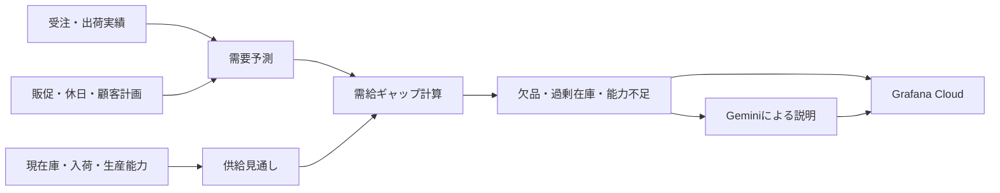
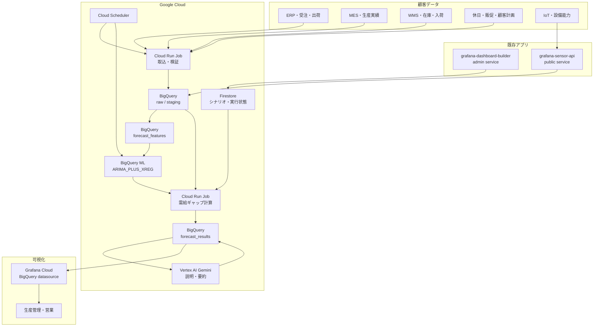
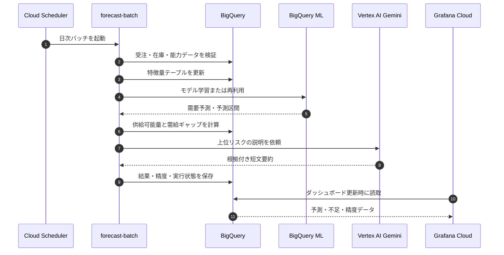
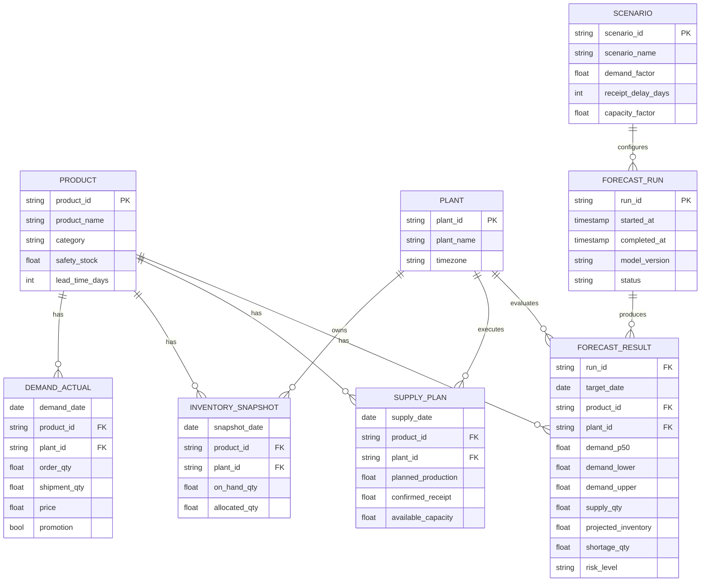
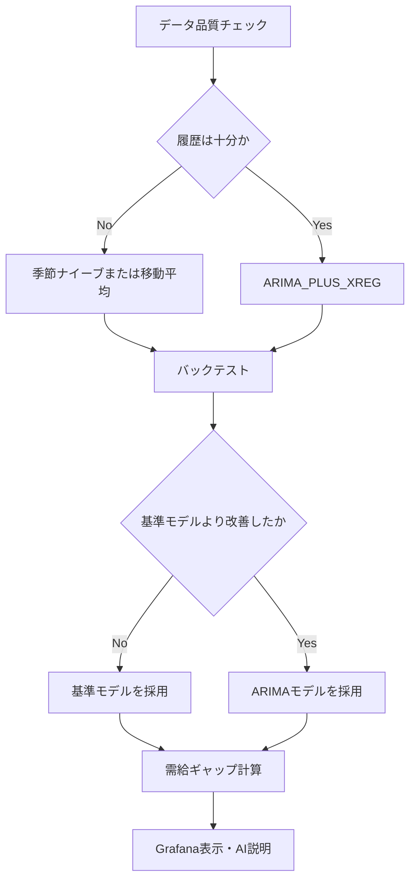
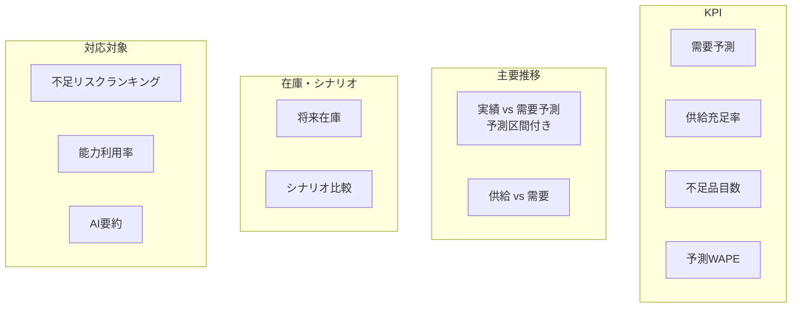
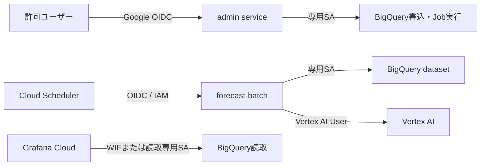
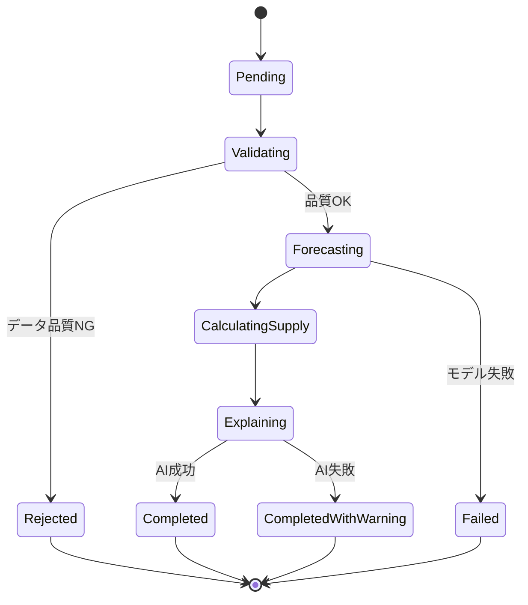
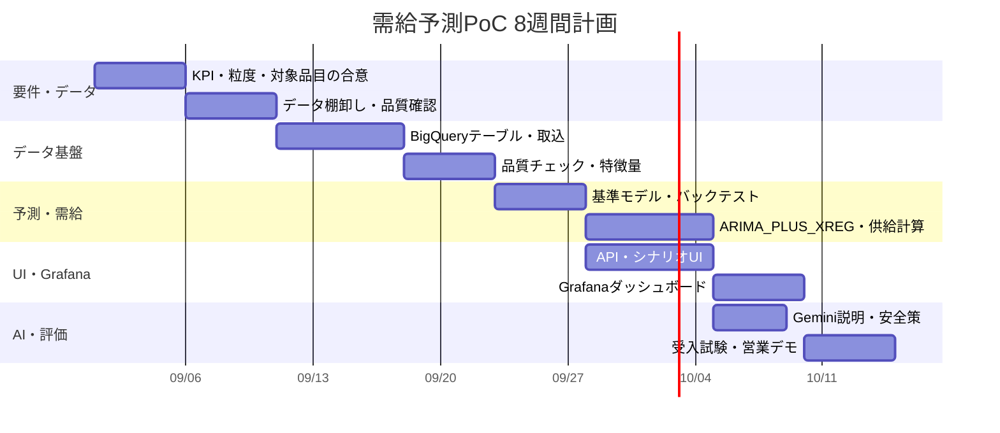

# 製造業向け AI 需給予測システム計画書

## 1. この計画の要点

本機能は、過去の受注・出荷・在庫・生産能力・調達予定を使って、将来の需要と供給余力を予測し、欠品や過剰在庫の兆候をGrafana Cloudで早期に確認できるようにする。

最初のPoCでは、次の役割分担を採用する。

| 役割 | 採用方式 | 理由 |
| --- | --- | --- |
| 需要の数値予測 | BigQuery ML `ARIMA_PLUS_XREG` | SQL中心で始められ、季節性・休日・外部要因と予測区間を扱える |
| 供給計画 | 在庫・入荷・生産能力を使う決定論的計算 | 計算根拠を業務担当者へ説明しやすい |
| 異常・不足判定 | ルールと閾値 | AI停止時でも継続できる |
| 原因説明・要約 | Vertex AI Gemini | 営業・生産管理担当者向けの自然言語説明に使う |
| 可視化 | Grafana Cloud + BigQuery datasource | 時系列、表、アラート、変数を同じ画面で扱える |

> 重要: Geminiだけで需要数量や発注量を決定しない。数値は時系列モデルと業務計算で作り、Geminiは説明・要約・シナリオ比較を担当する。

## 2. 目的

- 製品・部品ごとの需要を4週から12週先まで予測する
- 現在庫、入荷予定、生産能力を需要予測と比較する
- 欠品予定日、必要追加数量、過剰在庫を早期に可視化する
- 予測誤差と予測バイアスを継続監視する
- 営業担当者が顧客デモで需給変動シナリオを説明できるようにする
- 将来はERP、MES、WMS、受注管理との連携へ拡張する

## 3. 対象ユーザー

| ユーザー | 主な確認事項 |
| --- | --- |
| 生産管理 | 生産量、能力不足、欠品予定日 |
| 購買・調達 | 入荷遅延、必要追加数量、リードタイム |
| 営業 | 需要増減、顧客別・製品別の見通し |
| 経営・工場長 | 在庫金額、供給充足率、主要リスク |
| プリセールス | 顧客データがない段階でのシナリオデモ |

## 4. 業務での意味



需給予測は「需要を当てる」だけではなく、予測結果を供給可能量と比較し、業務上の対応が必要な箇所を示す機能とする。

### 4.1 基本計算

```text
供給可能量 = 現在庫 + 確定入荷 + 実行可能な生産量 - 安全在庫
需給ギャップ = 供給可能量 - 需要予測
不足数量 = max(0, -需給ギャップ)
過剰数量 = max(0, 需給ギャップ - 目標在庫)
```

## 5. 対象範囲

### 5.1 PoCに含める

- 日次または週次の需要予測
- 製品、工場、顧客、カテゴリによる絞り込み
- 予測値、実績値、予測区間の表示
- 現在庫、入荷予定、生産能力との比較
- 欠品リスクランキング
- 需要増、納入遅延、能力低下のシナリオ比較
- Geminiによる短い原因説明と推奨確認事項
- 予測精度、データ鮮度、バッチ実行状態の監視

### 5.2 PoCに含めない

- 発注書の自動発行
- 生産計画の自動確定
- AI判断だけによる在庫移動
- 秒単位のリアルタイム予測
- TestDataだけを使った予測精度の合否判定

人が結果を確認し、ERPや生産計画へ反映する「意思決定支援」までをPoC範囲とする。

## 6. 方式比較

| 方式 | 構成 | 長所 | 注意点 | 判定 |
| --- | --- | --- | --- | --- |
| A. BigQuery ML中心 | BigQuery ML + Cloud Run Job + Grafana | SQL中心、説明可能、運用が簡潔 | BigQueryのデータ整備が必要 | **推奨** |
| B. カスタムPythonモデル | Cloud Run JobまたはVertex AIでPythonモデル実行 | アルゴリズム自由度が高い | MLOpsと依存管理が増える | 第2段階 |
| C. 生成AIのみ | Geminiへ履歴を渡して数量を回答 | デモは容易 | 再現性、精度評価、監査性が不足 | 非推奨 |

PoCではAを採用し、Aが季節性や特殊な需要変動に対応できない場合だけBを追加する。

## 7. 推奨システム構成



### 7.1 既存システムから変えない部分

- `grafana-dashboard-builder` は認証済み管理UIとGrafana作成を担当する
- `grafana-sensor-api` はIoT受信と監視用読取を担当する
- Google OIDC、allowlist、Secret Manager、専用サービスアカウントを維持する
- Cloud Runの候補revision検証後に明示昇格する運用を維持する

### 7.2 新しく追加する部分

- BigQueryの需給予測データセット
- `forecast-batch` Cloud Run Job
- Cloud Schedulerによる日次実行
- Grafana Cloud BigQuery datasource
- 管理UIのシナリオ入力と予測実行状況
- 需給予測ダッシュボードテンプレート

`forecast-batch` は外部公開しない。スケジュール実行と管理者による手動実行だけを許可する。

## 8. データ処理フロー



## 9. データモデル案



## 10. 必要データ

| データ | 必須度 | 最低限の項目 | 推奨履歴 |
| --- | --- | --- | --- |
| 受注・出荷実績 | 必須 | 日付、製品、数量、工場 | 12か月以上、推奨24か月以上 |
| 現在庫 | 必須 | 日付、製品、工場、利用可能数 | 日次 |
| 入荷・生産予定 | 必須 | 予定日、製品、数量、確度 | 予測期間分 |
| 生産能力 | 必須 | 工場、設備、日次能力、停止予定 | 予測期間分 |
| 製品マスタ | 必須 | 製品、カテゴリ、安全在庫、LT | 最新 |
| 休日・販促 | 推奨 | 日付、種別、影響対象 | 1年以上 |
| 顧客内示 | 任意 | 顧客、製品、期間、数量 | 入手可能範囲 |
| IoT稼働率 | 任意 | 設備、時間、稼働率、停止 | 日次集約 |

履歴が短い製品、新製品、受注が極端に少ない製品は、統計予測と分けて「予測根拠不足」と表示する。

## 11. 予測ロジック



### 11.1 外部説明変数の例

- 曜日、月、祝日、連休
- 販促・価格変更
- 顧客内示数量
- 工場停止日
- 気温や電力使用量など需要に関係する外部データ

外部変数は「入れれば必ず精度が上がる」ものではない。バックテストで有効性を確認した項目だけ採用する。

### 11.2 精度指標

| 指標 | 用途 |
| --- | --- |
| WAPE | 全体の数量規模を考慮した誤差評価 |
| MAE | 平均的に何個外したかを確認 |
| Bias | 過大予測・過小予測の偏りを確認 |
| 欠品検知率 | 実際の欠品を事前に検知できた割合 |
| 供給充足率 | 予測需要に対して供給できる割合 |

PoC合格基準は顧客データ確認後に決める。初期目安は「季節ナイーブ予測よりWAPEを10%以上改善」かつ「重大欠品の見逃しを減らす」とする。

## 12. AIの利用方針

### 12.1 Geminiに任せること

- 需要変動要因の自然言語要約
- 欠品リスク上位品目の説明
- ベースケースとシナリオの差分説明
- 生産管理担当者が確認すべき項目の列挙
- 顧客向け説明文の生成

### 12.2 Geminiに任せないこと

- 予測数量の唯一の算出
- 発注数量の自動確定
- 生産指示の自動確定
- 元データにない原因の断定
- 安全在庫や供給能力の無断変更

### 12.3 AI出力例

```json
{
  "summary": "製品Aは第3週に不足へ転じる見込みです。",
  "drivers": [
    "過去4週の受注が平常比18%増加",
    "部品入荷が3日遅延",
    "第2ラインの計画能力が通常比80%"
  ],
  "recommendedChecks": [
    "顧客内示の確度を確認",
    "代替ラインへの振替可否を確認",
    "入荷前倒し可否を購買へ確認"
  ],
  "confidence": "medium"
}
```

AIへ渡す情報は集計済みの数値と説明可能な要因に限定し、顧客名、個人情報、機密単価は必要性を確認して除外またはマスキングする。

## 13. Grafanaダッシュボード案

### 13.1 ダッシュボード変数

- `$plant`: 工場
- `$product`: 製品
- `$category`: 製品カテゴリ
- `$scenario`: 基準、需要増、入荷遅延、能力低下
- `$horizon`: 4週、8週、12週

### 13.2 パネル構成

| 行 | パネル | 可視化 | 内容 |
| --- | --- | --- | --- |
| KPI | Forecast Demand | Stat | 予測期間の需要合計 |
| KPI | Supply Coverage | Gauge | 供給充足率 |
| KPI | Shortage Risk Items | Stat | 不足見込み品目数 |
| KPI | Forecast WAPE | Stat | 直近バックテスト誤差 |
| 推移 | Demand Forecast vs Actual | Time series | 実績、P50、予測区間 |
| 推移 | Supply vs Demand | Time series | 供給量と予測需要 |
| 推移 | Projected Inventory | Time series | 将来在庫と安全在庫 |
| 比較 | Scenario Comparison | Bar chart | シナリオ別不足数量 |
| 明細 | Shortage Risk Ranking | Table | 品目、予定日、不足数、理由 |
| 能力 | Capacity Utilization | HeatmapまたはTime series | 工場・ライン別能力負荷 |
| 品質 | Forecast Accuracy Trend | Time series | WAPEとBiasの推移 |
| AI | AI Supply-Demand Summary | TableまたはText | 要因と確認事項 |



## 14. 管理UI追加案

既存のダッシュボード提案ツールへ、`需給予測・生産計画`を新しいダッシュボード種別として追加する。


追加する入力:

- 予測単位: 日次・週次
- 予測期間: 4週・8週・12週
- 製品粒度: 製品・カテゴリ
- 工場・ライン
- 安全在庫方式
- シナリオ条件
- BigQuery datasource UID

## 15. API案

| Method | Endpoint | 用途 | 配置 |
| --- | --- | --- | --- |
| `POST` | `/api/forecast/scenarios` | シナリオ保存 | admin service |
| `GET` | `/api/forecast/scenarios` | シナリオ一覧 | admin service |
| `POST` | `/api/forecast/runs` | 手動予測実行要求 | admin service |
| `GET` | `/api/forecast/runs/:id` | 実行状態確認 | admin service |
| `GET` | `/api/forecast/summary` | UI向け集計 | admin service |
| `POST` | `/api/ai/forecast-explanation` | AI説明生成 | admin service |
| `GET` | BigQuery datasource query | Grafana可視化 | Grafana Cloud |

予測バッチ自体はCloud Run Jobとして実装し、公開HTTP APIにはしない。

## 16. セキュリティ設計



- admin、public、forecast-batchでサービスアカウントを分ける
- GrafanaにはBigQuery Data ViewerとJob Userの必要最小権限だけを付与する
- 可能ならGrafana CloudのWorkload Identity Federationを使い、長期サービスアカウントキーを避ける
- BigQuery datasetをraw、feature、resultに分け、Grafanaはresultだけ参照する
- BigQuery datasourceには最大課金バイト数を設定する
- AI実行、予測実行、シナリオ変更は監査ログへ記録する
- TestDataと本番データを同じDashboard UIDで混在させない

## 17. 障害時の動作



Geminiが失敗しても、数値予測と需給ギャップは表示する。前回成功結果を保持し、画面には更新日時とデータ鮮度を必ず表示する。

## 18. 監視・アラート

| 監視対象 | Warning | Critical |
| --- | --- | --- |
| データ鮮度 | 24時間超 | 48時間超 |
| 予測バッチ | 予定時刻から30分遅延 | 2回連続失敗 |
| WAPE | 顧客基準超過 | 2期間連続超過 |
| Bias | 過大・過小方向へ継続偏り | 安全在庫判断へ影響 |
| 欠品見込み | 14日以内 | 7日以内 |
| 供給充足率 | 95%未満 | 90%未満 |

閾値は業種、製品、リードタイムによって異なるため、固定値ではなく顧客設定として保持する。

## 19. PoCデモシナリオ

### シナリオA: 通常

- 需要と供給が均衡
- 在庫は安全在庫以上
- AI要約は「重大リスクなし」

### シナリオB: 需要急増

- 第3週から需要を20%増加
- 将来在庫が安全在庫を下回る
- 不足品目と不足予定日を表示

### シナリオC: 部品入荷遅延

- 主要部品の入荷を5日遅延
- 生産可能量が低下
- 代替調達または生産順序の確認を提示

### シナリオD: 設備能力低下

- IoT設備稼働率を通常比70%へ低下
- 供給充足率と欠品見込みの変化を表示
- 既存の設備保全ダッシュボードへのリンクを表示

## 20. 実装ロードマップ



開始日は例示であり、顧客データ提供日に合わせて調整する。

### 20.1 優先順位

| 優先度 | 対応 | 完了条件 |
| --- | --- | --- |
| P0 | データ定義と品質可視化 | 欠損・重複・鮮度を確認できる |
| P0 | 基準予測と精度評価 | 季節ナイーブとの比較ができる |
| P0 | 需給ギャップ計算 | 不足数と予定日を再現できる |
| P1 | Grafanaダッシュボード | 工場・製品・シナリオで絞り込める |
| P1 | シナリオ比較 | 需要増、遅延、能力低下を比較できる |
| P1 | Gemini説明 | 数値根拠を伴う要約を表示できる |
| P2 | ERP/MES自動連携 | 手動CSVなしで日次更新できる |
| P2 | 高度な最適化 | 制約付き生産・調達案を比較できる |

## 21. 受入条件

- 予測結果に実行日時、対象期間、モデル版、データ鮮度が表示される
- 実績、予測値、予測区間を同じ時系列で確認できる
- 不足数量の計算を元データから追跡できる
- 予測精度を基準モデルと比較できる
- Gemini停止時も数値パネルが利用できる
- 未認証ユーザーはシナリオ変更、AI実行、手動予測を実行できない
- Grafanaからraw顧客データを直接参照できない
- 同じ予測実行要求を重複処理しない
- Cloud Run Job失敗時に前回成功結果と失敗状態を区別できる
- PoCで自動発注・自動生産指示を行わない

## 22. 費用を抑える方針

- バッチは日次または必要時だけ実行し、常駐推論サービスを持たない
- PoC対象を代表50から200品目へ絞る
- BigQueryを日付・工場でパーティションし、製品でクラスタリングする
- Grafana datasourceに最大課金バイト数を設定する
- Geminiは全明細ではなく、リスク上位品目の要約だけに使う
- AI要約は予測run単位でキャッシュする
- モデル再学習は毎日ではなく、週次または精度悪化時に行う
- 予算アラートとBigQueryクエリ量の監視を設定する

## 23. 主なリスクと対策

| リスク | 影響 | 対策 |
| --- | --- | --- |
| 履歴不足 | 予測が不安定 | 基準モデル、カテゴリ集約、根拠不足表示 |
| マスタ不整合 | 製品別集計が誤る | 取込時の参照整合性チェック |
| 欠損・重複 | 予測誤差が増える | 品質ゲートを通らないrunは公開しない |
| 需要急変 | 過去パターンが通用しない | 顧客内示、シナリオ、予測区間を併用 |
| AIの誤説明 | 判断を誤る | 入力根拠を限定し、断定を禁止、人が確認 |
| BigQuery費用増 | 運用費増加 | パーティション、最大課金バイト、対象品目制限 |
| 機密情報露出 | セキュリティ事故 | WIF、最小権限、result datasetのみ公開 |
| 自動化への過信 | 誤発注・誤計画 | PoCは意思決定支援に限定 |

## 24. 実装ファイル案

```text
forecast/
  sql/
    001_create_tables.sql
    010_build_features.sql
    020_train_arima_xreg.sql
    030_generate_forecast.sql
    040_calculate_supply_gap.sql
  job/
    forecast-batch.js
    validate-input.js
  schemas/
    forecast-explanation.schema.json
dashboards/
  demand-supply-forecast-dashboard.json
scripts/
  setup-demand-supply-forecast-dashboard.js
  verify-demand-supply-forecast.js
docs/
  ai-demand-supply-forecast-plan.md
```

既存のNode.js標準ライブラリ中心の構成を維持する場合、BigQuery・Vertex AIはREST APIで呼び出す。処理が複雑化した段階で、予測JobだけをPythonへ分離する。

## 25. 最初に決めること

1. 予測対象は完成品、部品、材料のどれか
2. 日次と週次のどちらで判断するか
3. 予測期間は4週、8週、12週のどれか
4. 欠品の業務定義は何か
5. 安全在庫と確定入荷の扱い
6. 最も重要な工場・品目50件
7. 利用できる履歴期間と更新頻度
8. 顧客が許容する予測誤差
9. Grafana閲覧者とシナリオ変更者
10. PoC終了後にERPへ戻す情報

この10点が合意できれば、データモデルとPoC範囲を確定できる。

## 26. 参考資料

- [BigQuery forecasting overview](https://docs.cloud.google.com/bigquery/docs/forecasting-overview)
- [BigQuery ML ARIMA_PLUS_XREG](https://docs.cloud.google.com/bigquery/docs/reference/standard-sql/bigqueryml-syntax-create-multivariate-time-series)
- [BigQuery ML ML.EXPLAIN_FORECAST](https://docs.cloud.google.com/bigquery/docs/reference/standard-sql/bigqueryml-syntax-explain-forecast)
- [Cloud Run jobs](https://cloud.google.com/run/docs/create-jobs)
- [Cloud Run jobsをCloud Schedulerで定期実行](https://docs.cloud.google.com/run/docs/execute/jobs-on-schedule)
- [Grafana Google BigQuery datasource](https://grafana.com/docs/plugins/grafana-bigquery-datasource/latest/)
- [Grafana BigQuery datasource設定](https://grafana.com/docs/plugins/grafana-bigquery-datasource/latest/configure/)

## 27. 推奨する次の作業

1. 顧客データを想定した匿名サンプルCSVを作る
2. BigQueryテーブルと品質チェックSQLを作る
3. 季節ナイーブとARIMA_PLUS_XREGをバックテストする
4. 需給ギャップ計算SQLを作る
5. Grafana CloudにBigQuery datasourceを接続する
6. 需給予測ダッシュボードJSONを作る
7. 既存UIへ`需給予測・生産計画`を追加する
8. Gemini説明を最後に追加する

