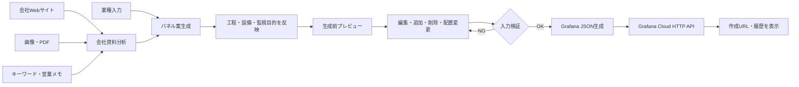
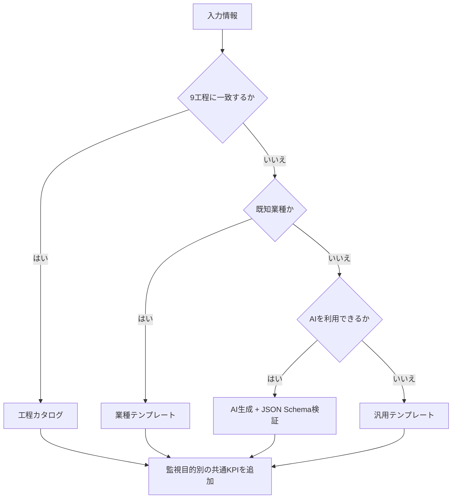
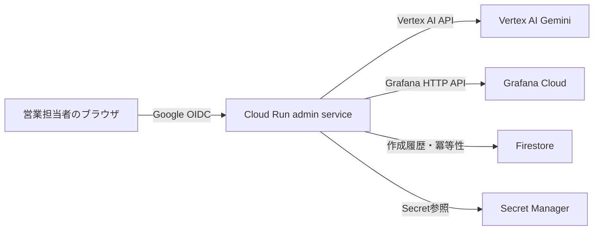

# Grafana Cloud ダッシュボード提案ツール 統合機能仕様

## 1. 文書の目的

本書は、営業担当者が顧客情報を入力し、製造業・IoT向けのパネル案を編集して、Grafana Cloudへダッシュボードを作成するまでの一連の機能をまとめた統合仕様である。

詳細な入力制約、API、認証、運用項目は次の文書を正とする。

- [ダッシュボード作成支援ツール仕様書](dashboard-builder-specification.md)
- [営業担当者向け利用ガイド](sales-user-guide.md)
- [会社資料分析の改善ループ](company-source-analysis-loop.md)
- [Google OIDC認証運用手順](google-oidc-authentication-runbook.md)

## 2. 対象範囲

| 項目 | 対象 |
| --- | --- |
| 利用者 | 製造業顧客を訪問する営業担当者、営業技術、PoC担当者 |
| 作成先 | Grafana Cloud |
| モックデータ | Grafana TestData datasource（UID `testdata`） |
| AI | Vertex AI Gemini。AIを利用できない場合は工程カタログ、既知業種テンプレート、汎用テンプレートへフォールバック |
| ホスティング | Google Cloud Run `grafana-dashboard-builder` |
| 主用途 | 設備保全、生産性、品質、エネルギー、IoTデバイス監視のデモ提案 |

実データの正常範囲、警報値、PLCアドレス、センサー精度を自動確定する機能は対象外である。TestDataの範囲とAI推定は顧客ヒアリング前のデモ値として扱う。

## 3. 全体フロー

## 4. 入力モード

### 4.1 業種入力

業種・工程・監視対象を文字列で入力する。例は「板金加工業者」「プレス加工業」「物流倉庫IoT」「電力監視IoTデバイス」である。

ダッシュボード種別は次から選択する。

- 製造ライン・設備保全
- IoTデバイス監視

監視目的は保全、生産性、品質、エネルギーから選択し、後段の共通KPIを切り替える。

### 4.2 会社資料入力

次の情報を1つ以上入力できる。

| 入力 | 制約・扱い |
| --- | --- |
| WebサイトURL | 公開された `http://` または `https://` URL。最大3回のリダイレクト、取得上限2MB |
| キーワード | 製品、工程、設備、材料、課題など |
| 営業メモ | 顧客から確認できた補足情報。秘密情報や個人情報を入力しない |
| 画像・PDF | JPEG、PNG、WebP、PDF。最大3件、1件5MB、合計10MB |

URL取得ではローカル、プライベート、リンクローカル、予約アドレスを拒否し、SSRFを防止する。取得HTMLはスクリプト、フォーム、埋め込み要素を除去してプレーンテキスト化する。

会社資料は命令ではなく未信頼データとして解析する。AI出力はJSON Schemaで検証し、次の区分をUIへ表示する。

- 確認できた情報
- AIによる推定
- 不足情報・顧客への確認事項
- 根拠
- 信頼度

利用者は分析結果を修正してからパネル案へ進める。添付ファイル本体は下書きや履歴へ保存しない。

## 5. パネル案の生成方針

### 5.1 工程カタログ

次の9工程を判定し、設備と監視パラメータに合った候補を優先する。

| 工程 | 代表的な監視例 |
| --- | --- |
| プレス | 荷重ピーク、モーター電流、ストローク数、金型温度、ミスフィード、サイクルタイム |
| 熱処理 | 炉内ゾーン温度、雰囲気ガス、カーボンポテンシャル、ヒーター電力、冷却液 |
| 鍍金・めっき | 整流器電流・電圧、積算電流、液面、液温、pH、導電率、排気差圧 |
| 放電 | 放電パルス、極間電圧、加工液、ワイヤテンション、断線、加工時間 |
| 研磨・研削 | 主軸負荷、軸受振動、クーラント、砥石摩耗、ドレッシング回数 |
| 溶接 | 電流・電圧、入熱、ガス圧・流量、ワイヤ送給、加圧力 |
| 切削 | 主軸負荷、振動、温度変位、クーラント、CNC状態・アラーム |
| 曲げ | 加圧力、油温、油圧、バックゲージ、サイクル、段取り時間 |
| 特殊加工 | レーザー出力、反射光、アシストガス、高圧水、酸素濃度 |

複数工程が入力された場合は各工程から代表パネルを選び、主要工程と選択設備へ重み付けする。工程固有パネルと共通KPIを重複排除して構成する。

### 5.2 共通KPI

工程固有センサーだけでは工場全体の状態を比較しにくいため、監視目的に応じてOEE、稼働率、停止時間、MTBF/MTTR、不良率、エネルギー原単位などの共通KPIを追加する。

## 6. 対応するGrafana可視化

| 可視化 | 適用例 | TestDataでの用途 |
| --- | --- | --- |
| Time series | 荷重、温度、電流、圧力の推移 | random walkによる時系列デモ |
| Stat | 現在値、稼働率、異常件数 | 最新値を大きく表示 |
| Gauge | 圧力、発電量、摩耗率 | 最小値から最大値までの現在位置 |
| Bar gauge | 複数設備・複数槽の値比較 | めっき槽液面などを横並び比較 |
| Bar chart | 期間別・カテゴリ別の数量比較 | プレスストローク数、ドレッシング回数 |
| Heatmap | 時間帯別の値・発生密度 | 主軸軸受振動の分布 |
| Pie chart / Donut | 設備別電力、状態構成比 | CSVによるカテゴリ別固定デモ値 |
| Table | 通信状態、アラーム、設備一覧 | CSVによる行データ |

新しい可視化の工程適用例は次のとおりである。

- プレス: `Press Stroke Count` をBar chartで表示
- 鍍金・めっき: `Bath Liquid Level` をBar gaugeで表示
- 研磨・研削: `Spindle Bearing Vibration` をHeatmapで表示

## 7. 生成前プレビューと編集

生成前プレビューはGrafanaのダークテーマに近い画面イメージを表示する。実際のGrafanaレンダリングそのものではないため、最終表示は作成後のGrafana Cloudで確認する。

利用者は次の操作を行える。

- プレビュー編集と一覧編集の切り替え
- パネル右上の3点メニューから詳細編集、複製、自動位置へ移動、削除
- パネル名、可視化、単位、最小値、最大値、異常方向、Warning/Critical閾値、目的の編集
- パネル追加、削除取り消し、並べ替え
- タイトル部分のマウス・タッチ操作によるドラッグ配置
- 配置を戻す、自動配置
- PC、Tablet、自動表示モードの切り替え

配置はGrafanaと同じ24カラムの `gridPos` として管理する。全パネル分を指定する場合は重複、範囲、整数値を検証し、Grafana dashboard JSONへ反映する。

編集内容と配置はブラウザのlocalStorageへ保存し、7日以内であれば再読み込み後に復元する。認証情報、APIキー、添付ファイルは保存しない。

## 8. パネル検証

パネルは最大24件とし、作成前に次を検証する。

- パネル名と可視化方式が有効である
- 最小値が最大値より小さい
- Warning/Critical閾値が範囲内で、異常方向と矛盾しない
- 最新値向け可視化では適切な集約を使用する
- `gridPos` が24カラム内にあり、パネル同士が重複しない

## 9. Grafana Cloudへの作成

1. Dashboard folderを取得して選択する。
2. TestData datasource（UID `testdata`）を確認し、存在しなければ作成する。
3. 編集済みパネルと `gridPos` からdashboard JSONを生成する。
4. Grafana HTTP API `/api/dashboards/db` へ送信する。
5. 作成結果URLと履歴を表示する。

上書きチェックがオフの場合、同じUIDが存在すると `_1`、`_2` のような接尾辞を付けて新規作成する。オンの場合だけ同じUIDを更新する。Dashboard folderは `folderUid` としてAPIへ渡す。

## 10. 主要API

| API | 目的 | 認証 |
| --- | --- | --- |
| `GET /api/ping` | Cloud Runプロセスの死活確認 | 不要 |
| `GET /api/auth-status` | UI認証状態の確認 | 不要 |
| `GET /api/runtime-status` | Grafana URL、AI、運用状態の確認 | Google OIDC |
| `POST /api/analyze-company-sources` | URL、資料、キーワードの企業分析 | Google OIDC |
| `POST /api/propose` | パネル案生成 | Google OIDC |
| `GET /api/folders` | Grafana folder一覧 | Google OIDC |
| `GET /api/datasources` | データソース一覧 | Google OIDC |
| `POST /api/create-dashboard` | Grafana Cloudダッシュボード作成 | Google OIDC |
| `GET /api/dashboard-history` | Firestore作成履歴取得 | Google OIDC |

POST APIは自動再送しない。APIタイムアウト、入力上限、レート制限、冪等性をサーバー側で検証する。

## 11. 本番構成

| 項目 | 値 |
| --- | --- |
| GCP Project | `modern-replica-465803-n8` |
| Region | `asia-northeast1` |
| Cloud Run service | `grafana-dashboard-builder` |
| Service account | `grafana-dashboard-builder-run@modern-replica-465803-n8.iam.gserviceaccount.com` |
| AI provider | Vertex AI |
| Grafana Cloud | `https://ytsutsumi30.grafana.net` |
| 本番URL | `https://grafana-dashboard-builder-pjvjufzh3q-an.a.run.app` |
| 認証 | Google OIDC、許可メールまたは許可ドメイン必須 |

Grafana Service Account TokenはSecret Managerから参照し、ソースコード、Markdown、ブラウザへ出力しない。Cloud Runはイメージdigestを固定した候補リビジョンを検証してから100%トラフィックへ昇格する。

## 12. 受入条件

- Node.js構文検証と関連テストが成功する
- UIがPC・Tablet幅で表示でき、主要操作が実行できる
- ブラウザconsole errorが0件である
- 会社URL、画像/PDF、キーワード入力の上限とSSRF対策が機能する
- 工程別提案が工程固有パネルを返す
- Bar chart、Bar gauge、Heatmapを選択・プレビュー・JSON生成できる
- 編集した閾値と配置がGrafana dashboard JSONへ反映される
- Cloud Run候補リビジョンの `/api/ping` が成功する
- Google OIDC未認証時に管理APIが拒否される
- 検証済みdigestのリビジョンだけを本番へ昇格する

## 13. 既知の制約

- 生成前プレビューはGrafanaの完全な描画エンジンではない
- TestDataは営業デモ用であり、実設備の異常判定には使用できない
- URL解析はJavaScript実行が必須のサイト、ログイン必須サイト、robotsや接続制限のあるサイトでは情報を取得できない場合がある
- AI推定は事実として扱わず、根拠と顧客確認事項を必ず確認する
- 実データ化では、データソース、クエリ、単位、正常範囲、欠損処理、アラート条件を設備ごとに再設計する
